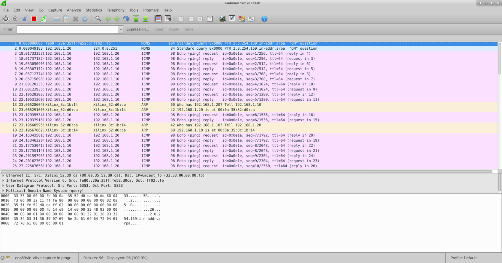

# Getting Started with Xilinx OpenNIC Design on NEU Servers

## Introduction
In this tutorial, we will walk through the steps of implementing the [Xilinx OpenNIC design](https://github.com/Xilinx/open-nic) on the two NEU Servers. First, we build the OpenNIC bitstream and create a shell which goes into the configuration memory of the U280s. Then, we flash this shell into both U280s via JTAG. Then we compile the OpenNIC driver code and build a kernel module (.ko file). Finally, we insert this module into the Linux kernel of both servers and run a ping test between the two to verify the network connectivity.

## Prerequisite 

- SSH connections to the two NEU servers.

- A VNC session. This is not mandatory. However, the VNC session will be persistent even if your SSH connection dropped out. Follow the instructions in [this](https://docs.google.com/document/d/1_JZ1K0lDdCTKP6TePhMbEBIyySO4jYZbF9-yBIQO07A/edit) tutorial for setting up SSH and VNC. 

## Clone the Xilinx OpenNIC Repo

`git clone https://github.com/Xilinx/open-nic`

Change the directory to `open-nic/script`.

Run `./checkout.sh <root directory of shell and driver>'. For example, if you want the shell and driver to be cloned into your home directory, you run:

`./checkout.sh ~`

## Hardware Build

The open-nic-shell is located at `<root directory>/github.com/Xilinx/open-nic-shell`.

### Make the following changes
Change the Vivado version to 2021.2 in `open-nic-shell/scripts/build.tcl`

`set VIVADO_VERSION "2021.2"`

### Build the OpenNIC bitstream
Before doing this, be sure to check out the CMAC license which is hosted on NERC. Bitstream generation will fail without this license.

`export XILINXD_LICENSE_FILE=2100@192.168.0.54`

Also, source the Vivado environment by running
`source /tools/Xilinx/Vitis/2021.2/settings64.sh`

Now, change the directory to `open-nic-shell/script`. You need to generate a memory configuration file (MCS) by running Vivado. To do this, run:

`vivado -mode batch -source build.tcl -tclargs -board au280 -impl 1 -post_impl 1 -jobs <number of jobs (default is 8)>`  

This command will run Vivado in batch mode to generate an mcs file that you will use to program the configuration memory device of the U280. Note that the build time can vary depending on the number of jobs that you specified. For `jobs=16`, the build time was observed to be about 70 minutes.

### Flash the OpenNIC shell 

Before you flash the shell, you should disable PCIe fatal error reporting by running a script. This is done in order to avoid kernel panic, and a subsequent server reboot caused by the iDRAC. Download the script [here](https://alexforencich.com/wiki/en/pcie/disable-fatal). To disable PCIe error reporting, you should run

`sudo ./pcie_disable_fatal.sh 0000:3b:00.0`

Now you are ready to program the MCS into the configuration memory of U280. The script `program_config_mem.tcl` provides the tcl commands that are required to do this. The only change that you need to make in this file is to change the path of the .mcs to the one that you have generated.

Run vivado in batch or gui mode to program the configuration memory. Do this on both servers.

`vivado -mode batch -source <path to the tcl/program_config_mem.tcl>`

If the vivado is not in the search path, run `source /tools/Xilinx/Vitis/2021.2/settings64.sh` to set up the enviroment.  

It takes about 20 miutes to complete this operation. If programming was successful, you should see the following message on the Linux terminal.

`Program/Verify Operation successful.`

After programming the configuration memory device, you need to cold-reboot the server. Follow [these](https://github.com/OCT-FPGA/P4/tree/main/OpenNIC-Getting-Started/iDrac-instructions.md) instructions.

## Software Build
  
The open-nic-driver is located at `<root directory>/github.com/Xilinx/open-nic-driver`. 

### Build the driver

Run `make` to build the kernel module. If the build was successful, you should see the generated kernel module `onic.ko`.  

### Insert the module into the kernel

Run the following command on both servers.

`sudo insmod onic.ko RS_FEC_ENABLED=0`

### Assign IP addresses

Assign IP addresses for the two 100 GbE interfaces of the U280s. For example:

Server 1: `sudo ifconfig enp59s0 192.168.1.10 netmask 255.255.255.0 up`

Server 2: `sudo ifconfig enp59s0 192.168.1.20 netmask 255.255.255.0 up`

## Ping Test

The two interfaces are now ready to communicate with each other over the network. Run a ping test to check the network connectivity. 

Example: Ping server 2 from server 1: `ping 192.168.1.20`

Now, you may run wireshark on server 2 to capture ICMP packets.

