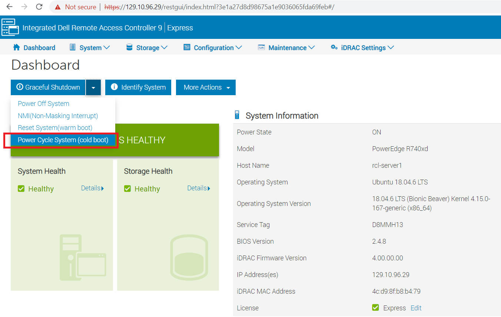

# Cold Rebooting (Power Cycling) Northeastern Servers

In order to power cycle the servers, you need to log into the servers' iDRAC dashboard with your iDRAC user name and password. Open a web browser window and enter the address of the iDRAC controller that you want to log into.

Server 1: 129.10.96.29

Server 2: 129.10.96.30

Select Power Cycle System (cold boot) as shown. Please let the other users know before you power cycle the server, so that they can save their work.

